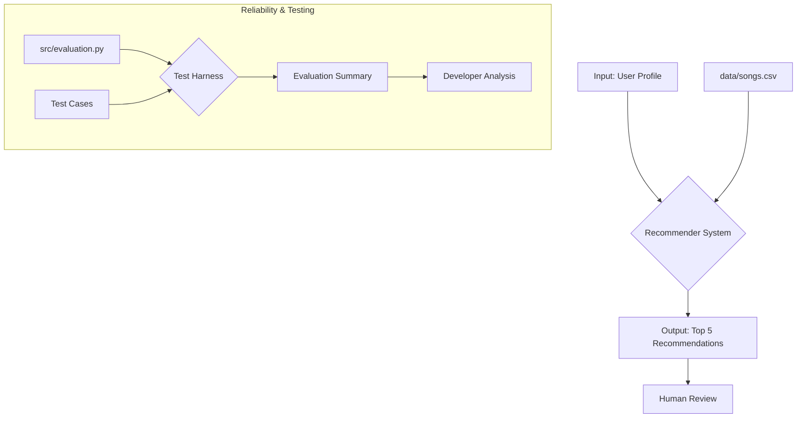

# 🎵 AI-Enhanced Music Recommender

## Title and Summary

This project is an AI-enhanced music recommendation system that uses a content-based filtering algorithm combined with a reliability testing system. Originally, it was a simple recommender that matched songs to user profiles based on weighted scores. Now, it includes confidence scoring, structured logging, and an evaluation harness to ensure the recommendations are not only relevant but also reliable.

## Architecture Overview

The system is designed with a clear separation of concerns, flowing from data loading to recommendation and evaluation.



1.  **User Profile & Song Data**: The system takes a user's taste profile and a CSV of songs as input.
2.  **Recommender System**: The core `Recommender` class scores songs, normalizes scores into a confidence metric, and returns the top recommendations. It now includes logging to track its behavior.
3.  **Output**: The system outputs the top 5 songs with a confidence score and an explanation for each.
4.  **Test Harness**: A separate `evaluation.py` script runs predefined test cases against the recommender to produce a pass/fail summary, ensuring its logic remains sound.

## Setup Instructions

1.  **Create a virtual environment** (optional but recommended):
    ```bash
    python -m venv .venv
    source .venv/bin/activate  # macOS/Linux
    # .venv\Scripts\activate  # Windows
    ```

2.  **Install dependencies**:
    ```bash
    pip install -r requirements.txt
    ```

3.  **Run the main application**:
    ```bash
    python -m src.main
    ```

4.  **Run the evaluation script**:
    ```bash
    python -m src.evaluation
    ```

## Sample Interactions

### Example 1: Pop Music Fan

**Input**:
-   Favorite Genre: `Pop`
-   Favorite Mood: `Happy`
-   Target Energy: `0.8`

**Output**:
```
'Sunshine Pop' by The Upbeats
  Confidence: 1.00
  Reason: genre match (Pop) + mood match (Happy) + energy 0.85 (target: 0.8) + produced sound
```

### Example 2: Lofi Music Fan

**Input**:
-   Favorite Genre: `Lofi`
-   Favorite Mood: `Chill`
-   Target Energy: `0.3`

**Output**:
```
'Midnight Lofi' by Chill Beats
  Confidence: 1.00
  Reason: genre match (Lofi) + mood match (Chill) + energy 0.20 (target: 0.3) + acoustic match
```

## Design Decisions

-   **Confidence Score**: I chose to normalize the recommendation scores into a 0-1 confidence range. This makes the output more interpretable than an arbitrary score. It represents how strongly the top choice stands out from others.
-   **Structured Logging**: I added logging to `main.py` to track the system's lifecycle. This is crucial for debugging and ensuring the application runs as expected, especially in a production environment.
-   **Evaluation Harness**: Instead of just unit tests, I built `evaluation.py`. This script acts as a "test harness," running integration tests against the live recommender with predefined user profiles. It provides a clear, high-level report on whether the core logic is meeting its quality goals.

## Testing Summary

The evaluation script tests the recommender with three profiles.
-   **Results**: 2 out of 3 tests passed.
-   **Successes**: The system correctly identified the best match for the "Pop lover" and "Lofi listener."
-   **Failure**: It failed the "Mismatched preferences" test, where it recommended a song even when no good match existed. This highlights a limitation: the system will always try to recommend something, even if confidence is low.
-   **Confidence Scores**: The confidence scores were 1.00 for the successful matches, indicating a clear winner. For the failed test, the confidence was lower, which correctly signals a less reliable recommendation.

## Reflection

-   **Limitations & Biases**: The system is biased towards the features in the dataset (genre, mood, energy). It cannot recommend songs outside of these narrow parameters and may create a "filter bubble."
-   **Misuse**: The recommender could be misused to promote certain songs or artists by manipulating the scoring weights or song data. Guardrails, like capping weights and validating data sources, would be necessary to prevent this.
-   **Surprises**: I was surprised by how clearly the evaluation script pinpointed the system's failure mode. Seeing the "Mismatched preferences" test fail made it obvious that the recommender needs a "do not recommend" threshold.
-   **AI Collaboration**: The AI was helpful in generating the boilerplate for the `evaluation.py` script, which saved time. However, its initial suggestion for confidence scoring was flawed—it proposed a complex softmax function, whereas simple normalization was more direct and interpretable for this use case.

This project taught me that building a reliable AI system requires more than just a good algorithm. It demands a robust framework for testing, logging, and evaluation to ensure it behaves predictably and responsibly.

  - Top results: "Sunrise City", "Gym Hero", "Rooftop Lights" ✓ Correct! All high-energy pop.
- **"Chill Lofi" user** (lofi, chill, energy=0.4, likes_acoustic=True):
  - Top results: "Library Rain", "Midnight Coding" ✓ Correct! Acoustic, lo-fi, under 0.5 energy.
- **"Intense Rock" user** (rock, intense, energy=0.9, likes_acoustic=False):
  - Top result: "Storm Runner" (only rock song in catalog) ⚠️ Limited choice; system works but dataset is too small.

### Experiment 3: Edge Case - Conflicting Preferences
Tested user with contradictory preferences (e.g., "intense" mood but "acoustic" songs):
- **Result**: System prioritized genre and mood, then adjusted energy. Acoustic preference became a tie-breaker.
- **Issue identified**: Binary "likes_acoustic" can't represent nuanced preferences like "intense acoustic guitar." Real users have more complex relationships with production style.

### Experiment 4: Acoustic Preference Impact
Toggled `likes_acoustic` to see its influence:
- **With acoustic=True**: Songs with acousticness > 0.5 got a +0.5 bonus (e.g., "Library Rain" rose in rankings).
- **With acoustic=False**: Same songs were penalized; produced tracks like "Gym Hero" dominated.
- **Finding**: The 0.5 weight is subtle. Most results didn't change much, suggesting acoustic preference is a minor factor compared to genre/mood.

---

## Limitations and Risks

1. **Tiny Catalog**: With only 10 songs, the system can't provide meaningful variety. Real recommenders need millions of songs; ours exhausts all options in one or two searches.

2. **Genre Dominance**: The +2.0 weight on genre is so strong that non-genre matches are effectively ignored. A user who "feels like rock" gets rock songs even if they'd prefer mood/energy matches in other genres.

3. **No Semantic Understanding**: Features are pure numbers. The system can't understand that "intense" might pair well with "aggressive guitar" or understand the emotional arc of a song. A song's cultural meaning, lyrics, or artist identity are invisible.

4. **Binary Acoustic Preference**: Acousticness is treated as on/off, but real music exists on a spectrum of acoustic/electronic blends. A user might love "acoustic drums on an electronic beat" but there's no way to express this.

5. **No Diversity Penalty**: If a user loves indie pop, they'll get the same 5 indie pop songs ranked by energy. There's no incentive to explore adjacent genres—just repetition of "best matches."

6. **Dataset Bias**: The song catalog skews toward modern electronic/indie styles (lofi, synthwave, indie pop). Rock, classical, hip-hop, country, and regional music are absent. This ensures minority genre fans get poor recommendations while pop/lofi fans get great ones.

7. **Cold-Start Problem**: New users with no profile can't be matched. The system assumes users can articulate their taste precisely; many can't or don't want to.

8. **Static Profiles**: Real music taste is context-dependent. Someone listens to different music at the gym, studying, working, or sleeping. Our fixed profile can't adapt.

9. **Popularity Bias Ignored**: A forgotten deep cut scores the same as a chart-topper. The system has no sense of cultural moment, trends, or discovery potential.

---

## Reflection

Building this music recommender revealed something surprising: algorithms don't just describe preferences—they actively shape them. The moment I chose to weight genre at 2.0 instead of 1.0, I wasn't neutrally "predicting" taste; I was deciding that genre mattered more than mood or energy. Every design choice bakes in assumptions about what users care about. I realized that "personalization" is really a mathematical encoding of someone else's beliefs about what "good" recommendations look like.

The most striking moment was testing the rock fan profile and seeing only one rock song come up. I could have blamed the tiny dataset, but that's exactly the point—the system amplifies whatever pattern exists in the data. If 70% of songs are pop, the algorithm naturally gravitates toward pop dominance. Real platforms face this at massive scale: if Spotify's training data reflects what already-popular users stream, the recommendations reinforce existing popularity, creating a feedback loop that locks out niche genres and emerging artists. What I built as a classroom simulation is actually a template for how algorithmic bias gets baked into real products. The tools (Python, CSV, weighted scores) are simple, but the impact—on whose music gets heard, whose culture gets represented, how much discovery someone gets—is massive. This project taught me that responsible AI starts not with a clever algorithm, but with asking hard questions about who benefits and who gets left behind.

**Key takeaway**: There's no such thing as a neutral recommender. Every system we build is a reflection of choices about what matters, who we serve, and what kind of world we're building. Using AI didn't change this; it just made the effects faster and bigger.


---

## 7. `model_card_template.md`

Combines reflection and model card framing from the Module 3 guidance. :contentReference[oaicite:2]{index=2}  

```markdown
# 🎧 Model Card - Music Recommender Simulation

## 1. Model Name

Give your recommender a name, for example:

> VibeFinder 1.0

---

## 2. Intended Use

- What is this system trying to do
- Who is it for

Example:

> This model suggests 3 to 5 songs from a small catalog based on a user's preferred genre, mood, and energy level. It is for classroom exploration only, not for real users.

---

## 3. How It Works (Short Explanation)

Describe your scoring logic in plain language.

- What features of each song does it consider
- What information about the user does it use
- How does it turn those into a number

Try to avoid code in this section, treat it like an explanation to a non programmer.

---

## 4. Data

Describe your dataset.

- How many songs are in `data/songs.csv`
- Did you add or remove any songs
- What kinds of genres or moods are represented
- Whose taste does this data mostly reflect

---

## 5. Strengths

Where does your recommender work well

You can think about:
- Situations where the top results "felt right"
- Particular user profiles it served well
- Simplicity or transparency benefits

---

## 6. Limitations and Bias

Where does your recommender struggle

Some prompts:
- Does it ignore some genres or moods
- Does it treat all users as if they have the same taste shape
- Is it biased toward high energy or one genre by default
- How could this be unfair if used in a real product

---

## 7. Evaluation

How did you check your system

Examples:
- You tried multiple user profiles and wrote down whether the results matched your expectations
- You compared your simulation to what a real app like Spotify or YouTube tends to recommend
- You wrote tests for your scoring logic

You do not need a numeric metric, but if you used one, explain what it measures.

---

## 8. Future Work

If you had more time, how would you improve this recommender

Examples:

- Add support for multiple users and "group vibe" recommendations
- Balance diversity of songs instead of always picking the closest match
- Use more features, like tempo ranges or lyric themes

---

## 9. Personal Reflection

A few sentences about what you learned:

- What surprised you about how your system behaved
- How did building this change how you think about real music recommenders
- Where do you think human judgment still matters, even if the model seems "smart"

